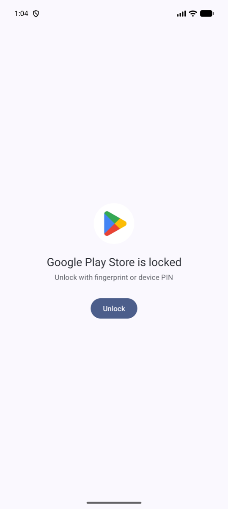
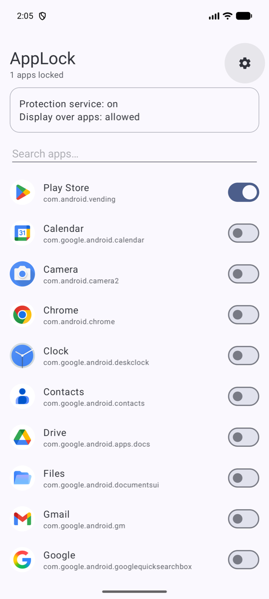
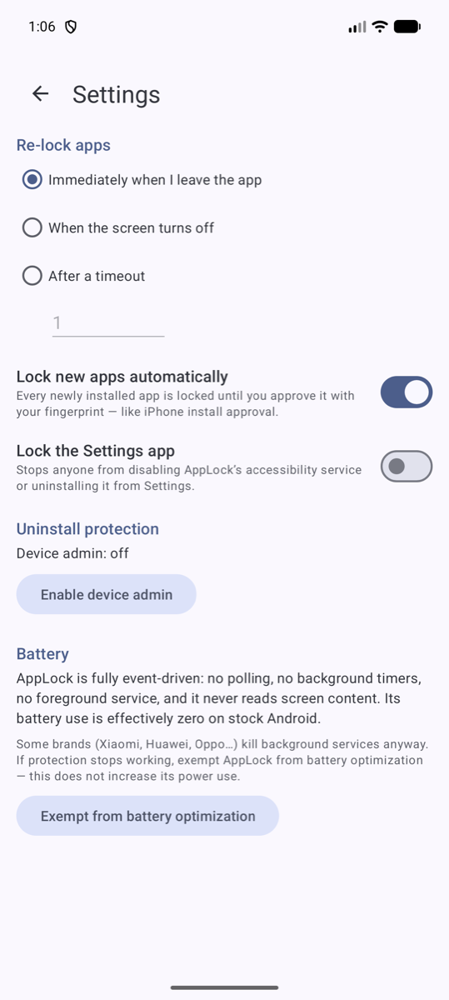

# AppLock

**Biometric app locking for Android with zero battery cost — including iPhone-style
"approve every new install with your fingerprint".**

[](https://github.com/vanrin/android-applock/actions/workflows/build.yml)
[](LICENSE)


| Locked app | App list | Settings |
|:---:|:---:|:---:|
|  |  |  |

## Why

iOS can require Face ID / Touch ID for every app installation. Android has no
equivalent: hand your unlocked phone to a child and they can install anything and
open anything. AppLock closes that gap:

- **Play Store is locked by default** — installing anything requires your fingerprint
  first.
- **Every newly installed app is auto-locked** the moment it lands (via
  `PACKAGE_ADDED`), before it can be opened. You approve it once with your
  fingerprint, like on iPhone.
- Any other app can be locked too, of course.

Built for the "parent hands phone to kid" threat model — not as spyware, not as
DRM: it deters kids and casual snoops, not a determined adult who knows your
device PIN.

## Features

- **Biometric lock screen** (fingerprint, with device PIN fallback) over any locked app
- **Auto-lock new installs** with a heads-up notification
- **Re-lock policies**: immediately on leave · when the screen turns off · after an
  N-minute grace period
- **Self-protection**
  - AppLock itself requires authentication every time it is opened
  - Optional lock on the system **Settings** app (blocks disabling the service or
    uninstalling from Settings)
  - Optional **Device Admin** — blocks uninstall until deactivated inside AppLock
- **Leak-proof UI**: `FLAG_SECURE` everywhere (no recents thumbnails, no
  screenshots of protected screens); Back from the lock screen always goes *home*,
  never into the locked app
- **Zero data collection** — no `INTERNET` permission at all ([PRIVACY.md](PRIVACY.md))

## Battery design

Most app lockers poll the foreground app on a timer. AppLock doesn't — its battery
use is effectively zero on stock Android:

| Decision | Effect |
|---|---|
| `AccessibilityService`, `TYPE_WINDOW_STATE_CHANGED` only | Process sleeps until the OS reports an app switch — no polling loop, ever |
| `canRetrieveWindowContent="false"` | Android never serializes view hierarchies for us — the real battery cost of most accessibility services |
| All lock state cached in RAM | The event path never touches disk |
| Lazy timeout evaluation via `elapsedRealtime()` | Re-lock grace periods need no timers, alarms, or scheduled jobs |
| No foreground service, no wakelocks | Nothing runs between window events |

## Install

1. Grab the APK from [Releases](../../releases), or build it yourself (below).
2. **Install via `adb`** (recommended):
   ```bash
   adb install AppLock-vX.Y.Z.apk
   ```
   Sideloading by tapping the APK also works, but expect two extra hoops:
   Play Protect will warn (an unknown app requesting accessibility — tap through
   or pause scanning briefly), and Android 13+ will require
   *App info → ⋮ → Allow restricted settings* before the accessibility service can
   be enabled. `adb install` skips both.
3. Open AppLock and follow the status card:
   - enable the **accessibility service**
   - allow **display over other apps**
4. Optional but recommended for the kid-proof setup: in ⚙ Settings enable
   **Device admin** and **Lock the Settings app**.

> **OEM note:** Xiaomi/Huawei/Oppo aggressively kill background services. If
> protection ever stops, use *Settings → Exempt from battery optimization* (it
> does not increase battery use — the service stays purely event-driven).

## How it works

| Component | Role |
|---|---|
| `AppLockService` | Accessibility service; receives window-change events, decides when to show the lock screen. Also hosts the `PACKAGE_ADDED/REMOVED` receiver (auto-lock new installs) and the `SCREEN_OFF` receiver (re-lock policies) — runtime-registered, since the process is alive exactly as long as protection is on |
| `LockScreenActivity` | Full-screen gate over the locked app; `BiometricPrompt` with device-credential fallback |
| `LockSession` | In-memory unlock sessions + re-lock policy bookkeeping; nothing persisted, reboot locks everything |
| `Prefs` | RAM-cached settings store (locked set, policy, toggles) |
| `GatedActivity` / `SelfGate` | Makes AppLock's own UI require authentication on every entry |
| `AdminReceiver` | Zero-policy device admin whose only job is blocking uninstall |

## Threat model

**Protects against:** children and casual snoops using your unlocked phone —
opening your apps, installing new ones, or disabling the lock.

**Does not protect against:** anyone who knows your device PIN (it is a valid
fallback credential), ADB access, or safe-mode boot (Android disables all
accessibility services there — no app can prevent that).

## Build from source

Requires JDK 17+ and the Android SDK (API 36).

```bash
./gradlew :app:assembleRelease
adb install app/build/outputs/apk/release/app-release.apk
```

Release builds are debug-signed out of the box so anyone can build and install.
To sign with your own key, create `keystore.properties` in the project root
(gitignored):

```properties
storeFile=/path/to/release.keystore
storePassword=...
keyAlias=...
keyPassword=...
```

Debug builds (`assembleDebug`) disable `FLAG_SECURE` so screens can be captured
for development and documentation; release builds always enforce it.

## Known limitations

- Re-locking after screen-off-while-foreground relies on the keyguard-dismiss
  window event; a few OEM builds don't fire it.
- An unlock session follows the *package*, not individual screens; the
  notification shade and system UI are intentionally ignored.
- Not designed for Play Store distribution: it deliberately uses the
  accessibility API + device admin, which Play policy restricts. This is a
  sideload-first project.

## Roadmap

- Built-in PIN as an alternative to device credentials (for devices without biometrics)
- Per-app re-lock policies
- Optional intruder log (failed attempts; still fully offline)
- F-Droid packaging

## Contributing & license

PRs welcome — see [CONTRIBUTING.md](CONTRIBUTING.md). Licensed under the
[MIT License](LICENSE).
